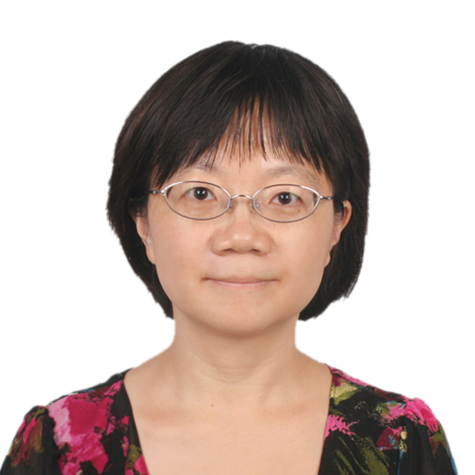

<table border="0">
  <tr>
     <td width="25%">
      
    </td>
    <td width="75%">
      <h1>Hua Wu</h1>
      
<b>Chief Scientist of Baidu NLP</b>

      
<b>Email：wu_hua@baidu.com</b>

      
<b>Address: Baidu Technology Park, Haidian Dictrict, Beijing 100193, China</b>

    </td>
  </tr>
</table>

 
Hua Wu is the chief scientist of Baidu NLP. Since 1998, she has been working on natural language processing. Over her ten years at Baidu, she and her team have achieved multiple technology breakthroughs in NLP and machine translation, many of which have been successfully deployed in a range of Baidu products used by hundreds of millions of users. 

### Research Interests
-	Machine Translation
-	Dialogue Systems
-	Knowledge-powered NLP methods

### Professional Activities
-	Program co-chair of AACL 2020
-	Area chair of IJCAI 2015
-	Program co-chair of ACL 2014
-	Area co-chair for Machine Translation in ACL 2012、IJCNLP 2011
-	Session Chair of Machine Translation in IJCNLP 2011

### Work Experience
-	Baidu (2010.2 ~),  Chief Scientist of Baidu NLP.
-	Toshiba (China) R&D Center (2003.6 ~ 2010.1), Senior Researcher. Machine Translation.
-	Microsoft Research Asia (2001.4 ~ 2003.5), Associate Researcher. Writing Assistant.

### Publications

Please refer to <a href="https://scholar.google.com/citations?user=9X2ThuAAAAAJ&hl=en" target="_self">Google Scholar</a> for a full list of publications.

